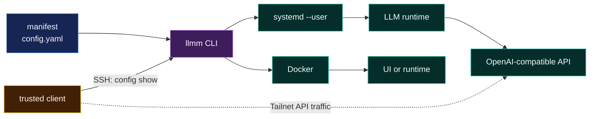

<div align="center">

# llmm

**One manifest. Native supervisors. No mystery daemon.**

`llmm` is a small, fast Go CLI that makes any LLM machine inspectable and operable — without trying to own the machine. Declare your runtimes and models once, and every status, doctor, start, and stop command stays in sync.

[](https://github.com/magiodev/llmm/actions/workflows/ci.yml)
[](https://goreportcard.com/report/github.com/magiodev/llmm)
[](https://go.dev/)
[](LICENSE)
[](CONTRIBUTING.md)

</div>

---

## The problem

Model servers already have enough moving parts. CUDA, model files, containers, systemd units, API endpoints, context limits, checksums: the information exists, but it tends to be scattered across shell history and half-remembered paths.

`llmm` puts the facts in one strict YAML manifest. It checks declared host prerequisites, reports runtime state, controls existing supervisors, and exports the manifest for trusted clients. It does not install runtimes, download models, wrap APIs, or run in the background.

```text
$ llmm status

example              active
open-webui       running

$ llmm models

example-model  example  /models/example-model.gguf

$ llmm doctor

ok    config                   /home/alice/.config/llmm/config.yaml
ok    runtime example              /opt/example/example-server
ok    service example              example.service
ok    model example-model  /models/example-model.gguf (86720111488 bytes)
```

## Why llmm is worth adopting

- **One source of truth.** Runtimes, models, paths, endpoints, limits, sizes, and checksums live together in a single manifest you can read and diff.
- **Strict input.** Unknown YAML fields fail validation instead of being silently ignored — a typo cannot silently change behavior.
- **Native lifecycle.** `systemctl --user` and Docker do the work they already know how to do; llmm is a thin, honest operator interface over them.
- **Useful diagnostics.** `doctor` checks host prerequisites and model integrity, with an optional `--deep` SHA-256 verification.
- **Clean remote access.** Trusted clients consume normalized YAML or JSON over SSH — no agent, no daemon, no protocol.
- **No resident process.** Every command starts, does its job, and exits. Nothing lurks in the background.

## The shape of it



The manifest describes reality. systemd and Docker supervise processes. `llmm` is the operator interface between them.

## What llmm does not do

`llmm` deliberately does not:

- install CUDA, drivers, systemd units, Docker, Tailscale, or model servers;
- download, convert, or quantize models;
- replace a model catalog or storage tool;
- generate backend-specific launch commands;
- proxy model traffic;
- store credentials;
- discover a cluster automatically;
- supervise processes itself.

Those boundaries are intentional. A DGX node may install Model Shelf, Hugging Face tooling, vLLM, or other utilities, but they remain independent of llmm.

## Install

llmm needs Go 1.22 or newer. There is no runtime dependency beyond a native `systemctl` or `docker` CLI matching your manifest.

### Go install

```bash
go install github.com/magiodev/llmm/cmd/llmm@latest
```

Go installs the binary into `$(go env GOPATH)/bin`; make sure that is on `PATH`.

### Build from source

```bash
git clone https://github.com/magiodev/llmm.git
cd llmm
make build          # or: go build -o llmm ./cmd/llmm
make test           # or: go test ./...
install -m 0755 llmm ~/.local/bin/llmm
```

Verify the install:

```bash
llmm --version
llmm --help
```

## From zero to a healthy node

A new operator gets a node running in four steps: **declare** the node, **stock** it with model artifacts, **validate** it, then **export** the trusted-client config. A terminal session looks like this:

```text
$ llmm config init
/home/alice/.config/llmm/config.yaml

$ llmm config show --format json
{"version":1,"node":"","runtimes":{"example":{"type":"systemd","service":"example.service"}},"models":{}}

$ # edit the manifest: add real paths, endpoints, models, artifacts
$ llmm doctor
ok    config                   /home/alice/.config/llmm/config.yaml
ok    runtime example              /opt/example/example-server
ok    service example              example.service
ok    model example-model  /models/example-model.gguf (86720111488 bytes)

$ llmm status
example              active
```

### 1. Declare the node

```bash
llmm config init
```

`config init` writes a minimal starter manifest (mode `0600`) and refuses to overwrite an existing file unless you pass `--force`. Edit it to describe reality: the node's name, the systemd services and Docker containers already running, and their endpoints.

```yaml
version: 1
node: dgx

runtimes:
  example:
    type: systemd
    service: example.service
    executable: /opt/example/example-server
    endpoint: http://dgx:8001/v1
models: {}
```

### 2. Stock the node with model artifacts

Add each model under `models`, with the primary file `path`, advertised limits, and — for sharded or companion layouts — an `artifacts` list. `doctor` treats every declared artifact as part of the model:

```yaml
models:
  vision:
    runtime: vllm
    format: safetensors
    path: /models/vision/model-00001-of-00002.safetensors
    context: 131072
    output: 8192
    artifacts:
      - path: /models/vision/model-00002-of-00002.safetensors
      - path: /models/vision/tokenizer.json
      - path: /models/vision/mmproj.mmap
```

llmm does not download or install models. It records what is already on the machine and checks it.

### 3. Validate the node

```bash
llmm config validate
llmm doctor
llmm status
llmm models
```

`doctor` checks host prerequisites (executables, loaded services, inspectable containers) and every model file and artifact — size by default, and `--deep` hashes and compares SHA-256 values. `status` reports what each native supervisor sees.

### 4. Export trusted-client config

```bash
llmm config show
llmm config show --format json
```

`config show` prints the normalized manifest for clients and scripts. Read it over SSH from a trusted client when you need remote access:

```bash
ssh dgx '$HOME/.local/bin/llmm config show --format json' | jq -r '.runtimes.example.endpoint'
```

The starter file is created with mode `0600`. `config init` refuses to overwrite an existing manifest unless you pass `--force`. Replace the example with facts from the machine you are declaring. A complete manifest is in [`examples/config.yaml`](examples/config.yaml); llmm does not install runtimes or create containers for you.

Common node shapes ship as separate examples: [`examples/systemd-one.yaml`](examples/systemd-one.yaml), [`examples/multi-systemd.yaml`](examples/multi-systemd.yaml), [`examples/docker-ui.yaml`](examples/docker-ui.yaml), and [`examples/multi-file.yaml`](examples/multi-file.yaml).

## Commands

| Command | Purpose |
|---|---|
| `llmm config init [--force]` | Create a minimal manifest |
| `llmm config validate` | Parse strictly and validate references |
| `llmm config show` | Print normalized YAML |
| `llmm config show --format json` | Print normalized JSON for clients and scripts |
| `llmm doctor` | Check config, executables, supervisor prerequisites, model files, and declared sizes |
| `llmm doctor --deep` | Also hash model files and compare SHA-256 values |
| `llmm doctor --format json` | Emit explicit check objects plus an overall `success` boolean |
| `llmm models` | List model ID, runtime, and path |
| `llmm models --format json` | Emit model objects with limits, default marker, and artifacts |
| `llmm status [runtime]` | Show every runtime or one named runtime |
| `llmm status --format json` | Emit runtime state objects for automation |
| `llmm start <runtime>` | Start through the configured native supervisor |
| `llmm stop <runtime>` | Stop through the configured native supervisor |
| `llmm restart <runtime>` | Restart through the configured native supervisor |
| `llmm completion <shell>` | Generate Cobra shell completion |

Use `--config PATH` for a one-off manifest or set `LLMM_CONFIG` to change the default. The CLI flag wins when both are supplied.

Full command documentation is in [docs/usage.md](docs/usage.md).

## Manifest

The manifest has four top-level concepts:

- `version`: schema version; currently `1`.
- `node`: stable logical machine name, such as `dgx` or `dgx-2`.
- `runtimes`: existing systemd user services or Docker containers.
- `models`: model metadata and integrity expectations, linked to runtimes by name.

`endpoint` is descriptive. llmm exports it for clients but does not probe or proxy it. Use an address trusted clients can reach, normally a Tailnet DNS name rather than `127.0.0.1`.

The complete schema reference and examples are in [docs/manifest.md](docs/manifest.md).

## Remote clients

The manifest belongs to the machine running the models. A MacBook or another trusted client reads it through SSH:

```bash
ssh dgx '$HOME/.local/bin/llmm config show'
ssh dgx '$HOME/.local/bin/llmm config show --format json'
```

Inspect a specific endpoint with `jq`:

```bash
ssh dgx '$HOME/.local/bin/llmm config show --format json' \
  | jq -r '.runtimes.example.endpoint'
```

Save a local snapshot only when a client actually needs a file:

```bash
mkdir -p ~/.config/llmm
ssh dgx '$HOME/.local/bin/llmm config show' > ~/.config/llmm/dgx.yaml
chmod 600 ~/.config/llmm/dgx.yaml
```

The snapshot is not authoritative. Fetch again when the node changes.

For several nodes, assign stable aliases (`dgx`, `dgx-2`, `dgx-3`) and query each manifest independently. This keeps failure domains obvious and avoids adding a registry service before one is needed.

See [docs/remote-clients.md](docs/remote-clients.md) for macOS setup, JSON consumption, cluster inventory examples, and security rules.

## Runtime behavior

For a `systemd` runtime, lifecycle commands map to:

```text
systemctl --user start|stop|restart <service>
```

For a `docker` runtime, they map to:

```text
docker start|stop|restart <container>
```

`status` reports `systemctl --user is-active` for systemd and Docker's container state for Docker. It does not claim that an HTTP endpoint is ready. Large models often continue loading after the supervisor reports `active`; use an API health or `/v1/models` probe before sending production traffic.

## Security model

- Keep the manifest mode `0600`.
- Do not put API keys, tokens, passwords, or private connection strings in it.
- Keep secrets in the runtime's native mechanism, such as systemd credentials, protected environment files, or a secret manager.
- Use Tailscale or another private network for remote endpoints.
- Give each client its own SSH key. Do not copy one private key between machines.
- Treat `config show` output as operational metadata. Transport it over authenticated SSH.
- Review lifecycle access carefully: anyone who can read the manifest and access its systemd-user manager or Docker daemon can control those workloads through llmm.

See [SECURITY.md](SECURITY.md) for the full policy and reporting process.

## Alternatives and related tools

`llmm` sits in a specific niche. Here is how it compares:

| Tool | Focus | Where llmm differs |
|---|---|---|
| vLLM, llama.cpp | Run a single model server | llmm does not launch or configure backends |
| Model catalogs / storage tools | Organize and download models | llmm records model facts and integrity, never downloads |
| Systemd / Docker / Kubernetes | Supervise processes | llmm is the thin operator interface over these |
| Cluster registries | Discover machines automatically | llmm stays per-node and failure-domain obvious |

If you already run systemd or Docker, llmm adds the missing operator layer without adding another resident process. If you need model provisioning or a catalog, use a dedicated tool and keep llmm pointed at what is already true on the machine.

## Project layout

```text
cmd/llmm/          thin executable entrypoint
internal/app/      Cobra commands and diagnostics
internal/config/   schema, strict parser, validation, serialization
internal/runtime/  systemd and Docker lifecycle adapters
examples/          portable example manifest
docs/              usage, schema, and remote-client guides
```

## Development

```bash
make fmt            # gofmt -w cmd internal
make test           # go test ./...
make vet            # go vet ./...
make build          # go build ./cmd/llmm
make cover          # coverage report + branch/line threshold check
```

The project intentionally has two direct dependencies:

- [Cobra](https://github.com/spf13/cobra) for the CLI;
- [yaml.v3](https://gopkg.in/yaml.v3) for strict YAML decoding.

Everything else uses the Go standard library or native host commands.

## Contributing

Bug reports, documentation fixes, and well-scoped feature PRs are welcome. See [CONTRIBUTING.md](CONTRIBUTING.md) for the contribution workflow, coding standards, and testing requirements. All community interaction follows the [CODE_OF_CONDUCT.md](CODE_OF_CONDUCT.md).

## Documentation

- [Usage and operations](docs/usage.md)
- [Manifest reference](docs/manifest.md)
- [Phase 1 contract](docs/contract.md)
- [Remote clients and clusters](docs/remote-clients.md)
- [Example manifests](examples/config.yaml) · [systemd-one](examples/systemd-one.yaml) · [multi-systemd](examples/multi-systemd.yaml) · [docker-ui](examples/docker-ui.yaml) · [multi-file](examples/multi-file.yaml)
- [Contributing](CONTRIBUTING.md) · [Security](SECURITY.md) · [Code of Conduct](CODE_OF_CONDUCT.md) · [Changelog](CHANGELOG.md)

## License

[MIT](LICENSE)
