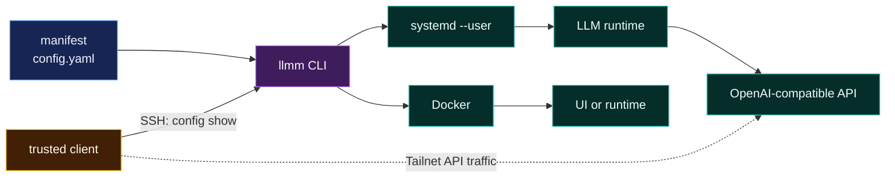

<div align="center">

# llmm

**One manifest. Native supervisors. No mystery daemon.**

`llmm` is a small Go CLI that makes an LLM machine inspectable and operable without trying to own the machine.

[](https://github.com/magiodev/llmm/actions/workflows/ci.yml)
[](https://go.dev/)
[](LICENSE)

</div>

---

Model servers already have enough moving parts. CUDA, model files, containers, systemd units, API endpoints, context limits, checksums: the information exists, but it tends to be scattered across shell history and half-remembered paths.

`llmm` puts the facts in one strict YAML manifest. It checks declared host prerequisites, reports runtime state, controls existing supervisors, and exports the manifest for trusted clients. It does not install runtimes, download models, wrap APIs, or run in the background.

```text
$ llmm status

ds4              active
open-webui       running

$ llmm models

deepseek-v4-flash  ds4  /models/deepseek-v4-flash.gguf

$ llmm doctor

ok    config                   /home/alice/.config/llmm/config.yaml
ok    runtime ds4              /opt/ds4/ds4-server
ok    service ds4              ds4-server.service
ok    model deepseek-v4-flash  /models/deepseek-v4-flash.gguf (86720111488 bytes)
```

## The shape of it



The manifest describes reality. systemd and Docker supervise processes. `llmm` is the operator interface between them.

## Why this exists

- **One source of truth:** runtimes, models, paths, endpoints, limits, sizes, and checksums live together.
- **Strict input:** unknown YAML fields fail validation instead of being silently ignored.
- **Native lifecycle:** `systemctl --user` and Docker do the work they already know how to do.
- **Useful diagnostics:** `doctor` checks host prerequisites and model integrity.
- **Clean remote access:** clients consume normalized YAML or JSON over SSH.
- **No resident process:** every command starts, does its job, and exits.

## What llmm does not do

`llmm` does not:

- install CUDA, drivers, systemd units, Docker, Tailscale, or model servers;
- download, convert, or quantize models;
- replace a model catalog or storage tool;
- generate backend-specific launch commands;
- proxy model traffic;
- store credentials;
- discover a cluster automatically;
- supervise processes itself.

Those boundaries are intentional. A DGX node may install Model Shelf, Hugging Face tooling, vLLM, DS4, or other utilities, but they remain independent of llmm.

## Install

Build with Go 1.22 or newer:

```bash
go install github.com/magiodev/llmm/cmd/llmm@latest
```

Or build from a clone:

```bash
git clone https://github.com/magiodev/llmm.git
cd llmm
go test ./...
go build -o llmm ./cmd/llmm
mkdir -p ~/.local/bin
install -m 0755 llmm ~/.local/bin/llmm
```

Check the installation:

```bash
llmm --version
llmm --help
```

## Quick start

Create a starter manifest:

```bash
llmm config init
```

Edit `~/.config/llmm/config.yaml`:

```yaml
version: 1
node: dgx

runtimes:
  ds4:
    type: systemd
    service: ds4-server.service
    executable: /opt/ds4/ds4-server
    endpoint: http://dgx:8001/v1
models: {}
```

Then validate the declaration against the machine:

```bash
llmm config validate
llmm doctor
llmm status
llmm models
```

The starter file is created with mode `0600`. `config init` refuses to overwrite an existing manifest unless you pass `--force`.

Replace the example with facts from the machine you are declaring. A complete manifest is in [`examples/config.yaml`](examples/config.yaml); llmm does not install runtimes or create containers for you.

## Commands

| Command | Purpose |
|---|---|
| `llmm config init [--force]` | Create a minimal manifest |
| `llmm config validate` | Parse strictly and validate references |
| `llmm config show` | Print normalized YAML |
| `llmm config show --format json` | Print normalized JSON for clients and scripts |
| `llmm doctor` | Check config, executables, supervisor prerequisites, model files, and declared sizes |
| `llmm doctor --deep` | Also hash model files and compare SHA-256 values |
| `llmm models` | List model ID, runtime, and path |
| `llmm status [runtime]` | Show every runtime or one named runtime |
| `llmm start <runtime>` | Start through the configured native supervisor |
| `llmm stop <runtime>` | Stop through the configured native supervisor |
| `llmm restart <runtime>` | Restart through the configured native supervisor |
| `llmm completion <shell>` | Generate Cobra shell completion |

Use `--config PATH` for a one-off manifest or set `LLMM_CONFIG` to change the default. The CLI flag wins when both are supplied.

Full command documentation is in [docs/usage.md](docs/usage.md).

## Manifest

The manifest has four top-level concepts:

- `version`: schema version; currently `1`.
- `node`: stable logical machine name, such as `dgx` or `dgx-2`.
- `runtimes`: existing systemd user services or Docker containers.
- `models`: model metadata and integrity expectations, linked to runtimes by name.

`endpoint` is descriptive. llmm exports it for clients but does not probe or proxy it. Use an address trusted clients can reach, normally a Tailnet DNS name rather than `127.0.0.1`.

The complete schema reference and examples are in [docs/manifest.md](docs/manifest.md).

## Remote clients

The manifest belongs to the machine running the models. A MacBook or another trusted client reads it through SSH:

```bash
ssh dgx '$HOME/.local/bin/llmm config show'
ssh dgx '$HOME/.local/bin/llmm config show --format json'
```

Inspect a specific endpoint with `jq`:

```bash
ssh dgx '$HOME/.local/bin/llmm config show --format json' \
  | jq -r '.runtimes.ds4.endpoint'
```

Save a local snapshot only when a client actually needs a file:

```bash
mkdir -p ~/.config/llmm
ssh dgx '$HOME/.local/bin/llmm config show' > ~/.config/llmm/dgx.yaml
chmod 600 ~/.config/llmm/dgx.yaml
```

The snapshot is not authoritative. Fetch again when the node changes.

For several nodes, assign stable aliases (`dgx`, `dgx-2`, `dgx-3`) and query each manifest independently. This keeps failure domains obvious and avoids adding a registry service before one is needed.

See [docs/remote-clients.md](docs/remote-clients.md) for macOS setup, JSON consumption, cluster inventory examples, and security rules.

## Runtime behavior

For a `systemd` runtime, lifecycle commands map to:

```text
systemctl --user start|stop|restart <service>
```

For a `docker` runtime, they map to:

```text
docker start|stop|restart <container>
```

`status` reports `systemctl --user is-active` for systemd and Docker's container state for Docker. It does not claim that an HTTP endpoint is ready. Large models often continue loading after the supervisor reports `active`; use an API health or `/v1/models` probe before sending production traffic.

## Security model

- Keep the manifest mode `0600`.
- Do not put API keys, tokens, passwords, or private connection strings in it.
- Keep secrets in the runtime's native mechanism, such as systemd credentials, protected environment files, or a secret manager.
- Use Tailscale or another private network for remote endpoints.
- Give each client its own SSH key. Do not copy one private key between machines.
- Treat `config show` output as operational metadata. Transport it over authenticated SSH.
- Review lifecycle access carefully: anyone who can read the manifest and access its systemd-user manager or Docker daemon can control those workloads through llmm.

## Project layout

```text
cmd/llmm/          thin executable entrypoint
internal/app/      Cobra commands and diagnostics
internal/config/   schema, strict parser, validation, serialization
internal/runtime/  systemd and Docker lifecycle adapters
examples/          portable example manifest
docs/              usage, schema, and remote-client guides
```

## Development

```bash
gofmt -w cmd internal
go test ./...
go vet ./...
go build ./cmd/llmm
git diff --check
```

The project intentionally has two direct dependencies:

- [Cobra](https://github.com/spf13/cobra) for the CLI;
- [yaml.v3](https://gopkg.in/yaml.v3) for strict YAML decoding.

Everything else uses the Go standard library or native host commands.

## Documentation

- [Usage and operations](docs/usage.md)
- [Manifest reference](docs/manifest.md)
- [Remote clients and clusters](docs/remote-clients.md)
- [Example manifest](examples/config.yaml)

## License

[MIT](LICENSE)
