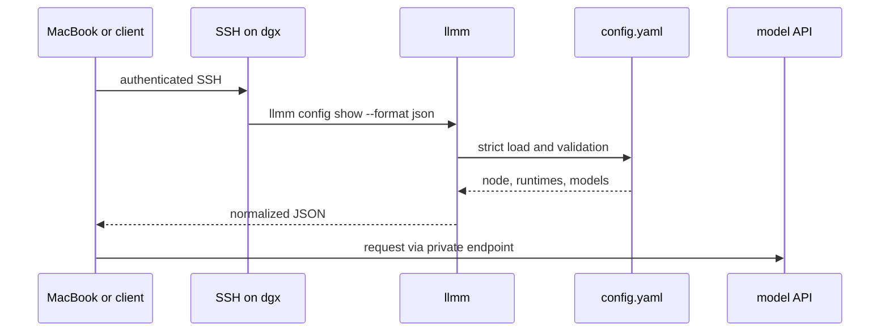

# Remote clients and clusters

A model node owns its manifest. Clients read normalized data over authenticated SSH and use private-network endpoints to reach model APIs. This design needs no config server, sync daemon, shared filesystem, or Git repository containing host state.

## Data flow



SSH is the control-plane transport. The model endpoint is the data plane. They do not need to use the same address, but both should stay private.

## macOS setup

### 1. Join the Tailnet

Install and authenticate Tailscale on the MacBook. Confirm that the node resolves:

```bash
tailscale status
ping -c 1 dgx
```

If Tailnet DNS is unavailable, use the node's stable Tailscale IP as `HostName` in SSH config.

### 2. Create a client-specific SSH key

Generate a key on the MacBook if it does not already have one for the node:

```bash
ssh-keygen -t ed25519 -f ~/.ssh/id_dgx -C "macbook-to-dgx"
```

Protect the private key:

```bash
chmod 600 ~/.ssh/id_dgx
chmod 644 ~/.ssh/id_dgx.pub
```

Authorize only the public key on the node. Do not copy a private key from another computer.

### 3. Add an SSH alias

Add this to `~/.ssh/config` on the MacBook:

```sshconfig
Host dgx
  HostName dgx
  User magiodev
  IdentityFile ~/.ssh/id_dgx
  IdentitiesOnly yes
  ServerAliveInterval 60
  ServerAliveCountMax 3
```

If using a numeric Tailnet address:

```sshconfig
Host dgx
  HostName 100.87.195.52
  User magiodev
  IdentityFile ~/.ssh/id_dgx
  IdentitiesOnly yes
  ServerAliveInterval 60
  ServerAliveCountMax 3
```

Test non-interactively:

```bash
ssh -o BatchMode=yes dgx 'printf connected'
```

### 4. Read the manifest

YAML for a human:

```bash
ssh dgx '$HOME/.local/bin/llmm config show'
```

JSON for software:

```bash
ssh dgx '$HOME/.local/bin/llmm config show --format json'
```

Use the full binary path. Non-interactive SSH sessions often do not source shell profiles, so `~/.local/bin` may not be on `PATH`.

## Consume without saving

Read the node name:

```bash
ssh dgx '$HOME/.local/bin/llmm config show --format json' \
  | jq -r '.node'
```

Read all advertised endpoints:

```bash
ssh dgx '$HOME/.local/bin/llmm config show --format json' \
  | jq -r '.runtimes | to_entries[] | "\(.key)\t\(.value.endpoint // "-")"'
```

Read model limits:

```bash
ssh dgx '$HOME/.local/bin/llmm config show --format json' \
  | jq -r '.models | to_entries[] | [
      .key,
      (.value.context // 0),
      (.value.output // 0),
      .value.runtime
    ] | @tsv'
```

Resolve the endpoint for a model by following its runtime reference:

```bash
ssh dgx '$HOME/.local/bin/llmm config show --format json' \
  | jq -r '
      . as $manifest
      | .models["deepseek-v4-flash"].runtime as $runtime
      | $manifest.runtimes[$runtime].endpoint
    '
```

## Consume from Python

This example uses only the Python standard library and OpenSSH:

```python
import json
import subprocess

raw = subprocess.check_output(
    [
        "ssh",
        "-o",
        "BatchMode=yes",
        "-o",
        "ConnectTimeout=5",
        "dgx",
        "$HOME/.local/bin/llmm",
        "config",
        "show",
        "--format",
        "json",
    ],
    text=True,
    timeout=15,
)

manifest = json.loads(raw)
model = manifest["models"]["deepseek-v4-flash"]
runtime = manifest["runtimes"][model["runtime"]]

print(manifest["node"])
print(runtime["endpoint"])
print(model["context"], model["output"])
```

Set both SSH and subprocess timeouts. A client should fail clearly when a node is unreachable rather than hanging indefinitely.

## Save a snapshot

Some clients require a file instead of a command pipeline:

```bash
mkdir -p ~/.config/llmm
umask 077
ssh dgx '$HOME/.local/bin/llmm config show' > ~/.config/llmm/dgx.yaml
```

For JSON:

```bash
umask 077
ssh dgx '$HOME/.local/bin/llmm config show --format json' \
  > ~/.config/llmm/dgx.json
```

Write atomically when another process may read the file:

```bash
set -e
dir="$HOME/.config/llmm"
mkdir -p "$dir"
umask 077
ssh dgx '$HOME/.local/bin/llmm config show --format json' > "$dir/dgx.json.tmp"
mv "$dir/dgx.json.tmp" "$dir/dgx.json"
```

A snapshot is a cache. The source remains `~/.config/llmm/config.yaml` on the node. Do not edit the snapshot and expect the node to change.

## Verify before consuming

`config show` already parses and validates the manifest. Clients that need live service assurance should also query runtime state and the API:

```bash
ssh dgx '$HOME/.local/bin/llmm status ds4'
curl -fsS http://dgx:8001/v1/models
```

These checks answer different questions:

- `config show`: is the declaration structurally valid?
- `status`: does the native supervisor report the workload running?
- API probe: is the service ready to answer requests?

A large model can pass the first two while still loading.

## Configure an OpenAI-compatible client

Extract the endpoint and model ID rather than hardcoding both in several places:

```bash
manifest="$(ssh dgx '$HOME/.local/bin/llmm config show --format json')"
model="deepseek-v4-flash"
runtime="$(jq -r --arg model "$model" '.models[$model].runtime' <<<"$manifest")"
base_url="$(jq -r --arg runtime "$runtime" '.runtimes[$runtime].endpoint' <<<"$manifest")"
context="$(jq -r --arg model "$model" '.models[$model].context' <<<"$manifest")"
output="$(jq -r --arg model "$model" '.models[$model].output' <<<"$manifest")"

printf 'model=%s\nbase_url=%s\ncontext=%s\noutput=%s\n' \
  "$model" "$base_url" "$context" "$output"
```

The client remains responsible for translating those facts into its own configuration schema. llmm deliberately does not rewrite Hermes, OpenCode, editor, or application config files.

## Several nodes

Give each node a stable logical name and matching SSH alias:

```text
dgx
dgx-2
dgx-3
```

Each node owns one manifest:

```yaml
version: 1
node: dgx-2
runtimes: { ... }
models: { ... }
```

### Fetch a fleet inventory

```bash
set -e
mkdir -p ~/.cache/llmm
umask 077

for host in dgx dgx-2 dgx-3; do
  ssh -o BatchMode=yes -o ConnectTimeout=5 "$host" \
    '$HOME/.local/bin/llmm config show --format json'
done | jq -s '.' > ~/.cache/llmm/fleet.json.tmp

mv ~/.cache/llmm/fleet.json.tmp ~/.cache/llmm/fleet.json
```

Result:

```json
[
  {
    "version": 1,
    "node": "dgx",
    "runtimes": {},
    "models": {}
  },
  {
    "version": 1,
    "node": "dgx-2",
    "runtimes": {},
    "models": {}
  }
]
```

### Best-effort inventory

When partial results are acceptable, handle each node independently:

```bash
set -u
mkdir -p ~/.cache/llmm/nodes
umask 077

for host in dgx dgx-2 dgx-3; do
  target="$HOME/.cache/llmm/nodes/$host.json"
  if ssh -o BatchMode=yes -o ConnectTimeout=5 "$host" \
      '$HOME/.local/bin/llmm config show --format json' > "$target.tmp"; then
    mv "$target.tmp" "$target"
  else
    rm -f "$target.tmp"
    printf 'unreachable: %s\n' "$host" >&2
  fi
done
```

This preserves the last successful snapshot for each reachable node only if your surrounding workflow chooses to keep old files. Decide explicitly whether stale data is acceptable.

### Merge model locations

Given a JSON array of manifests:

```bash
jq -r '
  .[] as $node
  | $node.models
  | to_entries[]
  | [
      .key,
      $node.node,
      .value.runtime,
      ($node.runtimes[.value.runtime].endpoint // "-")
    ]
  | @tsv
' ~/.cache/llmm/fleet.json
```

This yields model ID, node, runtime, and endpoint without requiring a registry daemon.

## Choosing a cluster strategy

Start with independent SSH queries. Add a registry only when there is a demonstrated need for:

- automatic scheduling across nodes;
- frequent topology changes;
- leases or distributed locks;
- service discovery for many clients;
- a fleet size where serial SSH becomes a measurable problem.

A second machine does not automatically justify a control-plane service. Stable aliases and normalized JSON cover small personal and lab clusters well.

## SSH tunnels

When an API binds only to loopback, tunnel it instead of exposing it broadly:

```bash
ssh -N -L 8001:127.0.0.1:8001 dgx
```

The client then uses:

```text
http://127.0.0.1:8001/v1
```

A manifest intended for direct Tailnet access should advertise the Tailnet endpoint. A client creating a tunnel may deliberately override that endpoint locally.

## Security

### Keep secrets out of manifests

Do not store:

- API keys or bearer tokens;
- SSH private keys;
- Hugging Face tokens;
- passwords;
- secret environment values;
- URLs containing credentials.

The normalized output is only as safe as the source manifest.

### Use one SSH key per client

Separate keys let you revoke one lost device without breaking every client. Use meaningful comments when generating keys and remove obsolete public keys from `authorized_keys`.

### Restrict network reachability

Prefer Tailnet DNS or Tailscale IPs. Do not expose model APIs or Open WebUI to the public internet merely to simplify client configuration.

### Treat lifecycle access as privileged

Reading `config show` reveals paths, topology, and model inventory. Running lifecycle commands can interrupt workloads. If a client only needs manifest access, restrict its SSH authorization rather than granting a broad interactive shell.

OpenSSH supports forced commands and dedicated authorized keys. A restricted key can be limited to a wrapper that only executes:

```text
$HOME/.local/bin/llmm config show --format json
```

Implement and audit such a wrapper on the node if untrusted automation needs read-only access. Do not construct forced commands by interpolating arbitrary client arguments.

### Check host keys

Do not disable host-key verification in permanent client configuration. Pin or accept the node's host key through a trusted channel and investigate unexpected changes.

## Failure handling

### Node unreachable

Use `BatchMode=yes`, `ConnectTimeout`, and a process timeout. Report the node as unavailable. Do not silently substitute another node unless the application has an explicit failover policy.

### Invalid manifest

`config show` exits non-zero and prints the validation problem. Keep the last known-good snapshot only when stale operation is safer than no operation, and mark it as stale.

### Endpoint unreachable

A valid manifest is not a health signal. Probe the endpoint and distinguish DNS failure, connection refusal, timeout, authentication failure, and model-loading state.

### Node identity mismatch

A client querying SSH alias `dgx-2` may verify that the returned `.node` is also `dgx-2`:

```bash
host=dgx-2
actual="$(ssh "$host" '$HOME/.local/bin/llmm config show --format json' | jq -r '.node')"
[ "$actual" = "$host" ] || {
  printf 'node mismatch: expected %s, got %s\n' "$host" "$actual" >&2
  exit 1
}
```

This catches copied manifests and alias mistakes before a client routes traffic to the wrong machine.

## Why SSH instead of a config endpoint?

SSH is already authenticated, encrypted, auditable, and available for node administration. Adding a config HTTP service would create another process, port, authentication mechanism, update path, and failure mode to distribute a small file.

If a future fleet outgrows SSH queries, normalized JSON provides a clean boundary for a dedicated inventory collector. That collector can be added later without changing the per-node manifest.
